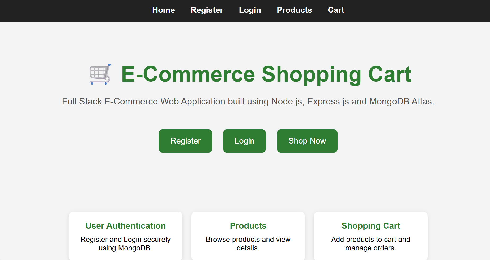
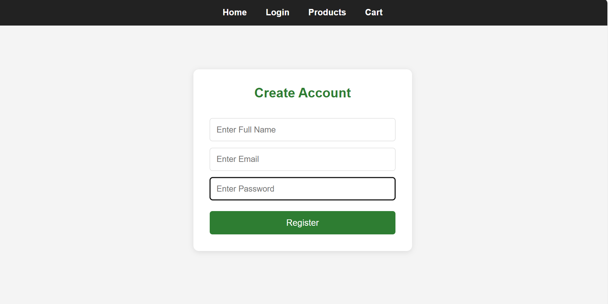
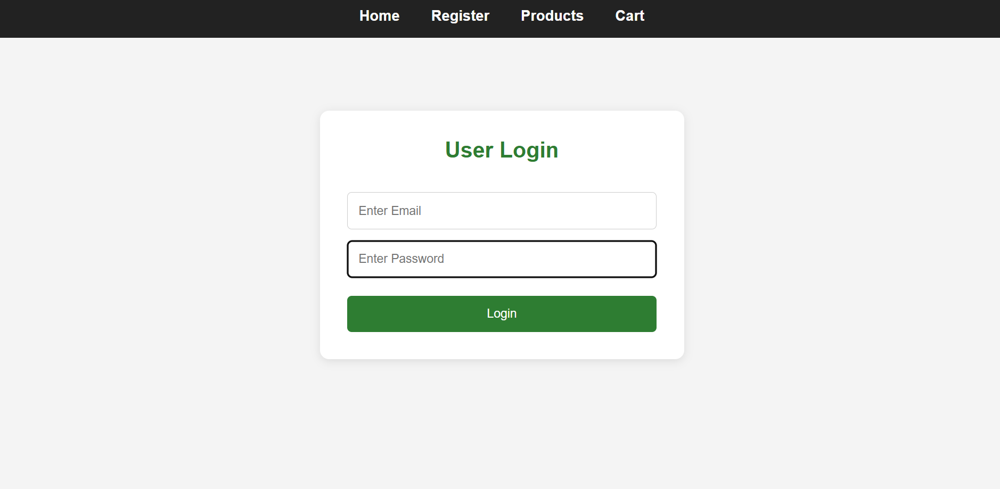
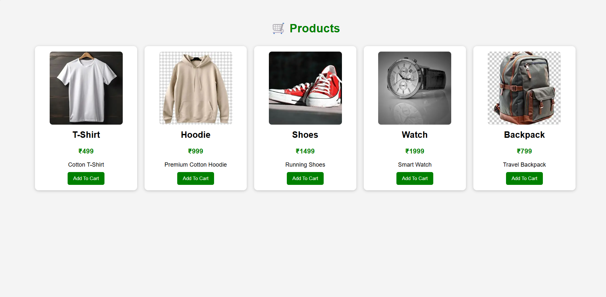
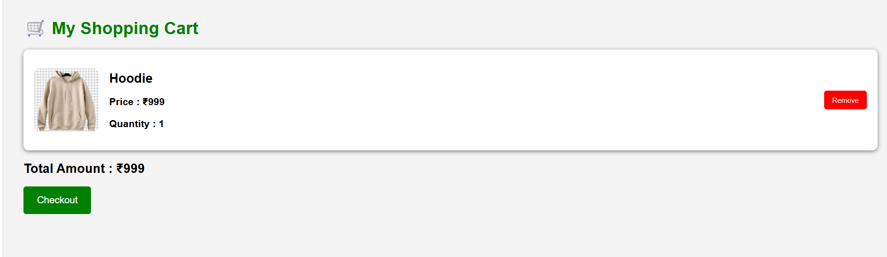
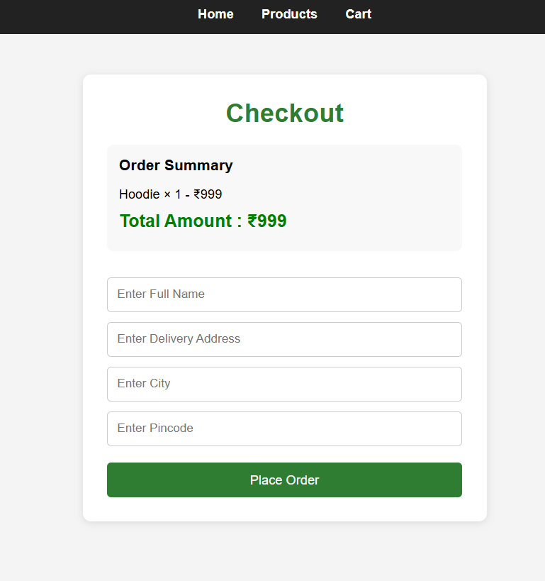

# 🛒 E-Commerce Shopping Cart Web Application

## 📌 Project Overview

This is a Full Stack E-Commerce Shopping Cart Web Application developed using HTML, CSS, JavaScript, Node.js, Express.js, and MongoDB Atlas.

The application allows users to register, login, view products, add products to the cart, remove products from the cart, and place orders through a checkout system.

---

## 🚀 Features

### User Module
- User Registration
- User Login
- User Profile
- Logout Functionality

### Product Module
- View Products
- Product Images
- Product Prices
- Product Descriptions

### Cart Module
- Add To Cart
- View Cart
- Remove From Cart
- Calculate Total Amount

### Checkout Module
- Shipping Details Form
- Order Confirmation
- Success Page

### Database
- MongoDB Atlas Integration
- Product Storage
- User Storage
- Cart Storage

---

## 🛠️ Technologies Used

### Frontend
- HTML5
- CSS3
- JavaScript

### Backend
- Node.js
- Express.js

### Database
- MongoDB Atlas
- Mongoose

### Tools
- VS Code
- Thunder Client
- Git
- GitHub

---

## 📂 Project Structure

```text
ecommerce_store
│
├── backend
│   ├── config
│   ├── controllers
│   ├── models
│   ├── routes
│   └── server.js
│
├── frontend
│   ├── image
│   ├── index.html
│   ├── register.html
│   ├── login.html
│   ├── product.html
│   ├── cart.html
│   ├── checkout.html
│   ├── profile.html
│   └── success.html
│
├── screenshots
├── package.json
├── README.md
└── .env.example
```

---

## 📸 Screenshots

### Home Page


### Register Page


### Login Page


### Products Page


### Cart Page


### Checkout Page


---

## ⚙️ Installation

### Clone Repository

```bash
git clone https://github.com/yourusername/ecommerce-shopping-cart.git
```

### Install Dependencies

```bash
npm install
```

### Configure Environment Variables

Create a `.env` file:

```env
PORT=5000
MONGO_URI=your_mongodb_connection_string
JWT_SECRET=your_secret_key
```

### Run Project

```bash
npm run dev
```

Server will run at:

```text
http://localhost:5000
```

Frontend:

```text
http://127.0.0.1:5500/frontend/index.html
```

---

## 🔄 Application Flow

```text
Home
   ↓
Register
   ↓
Login
   ↓
Products
   ↓
Add To Cart
   ↓
Cart
   ↓
Checkout
   ↓
Order Success
```

---

## 🎯 Learning Outcomes

- Full Stack Web Development
- REST API Development
- MongoDB Atlas Integration
- CRUD Operations
- User Authentication
- Frontend and Backend Integration

---

## 👩‍💻 Developed By

**Shamithri**

CodeAlpha Internship Project

---

## 📜 License

This project is developed for educational and internship purposes.